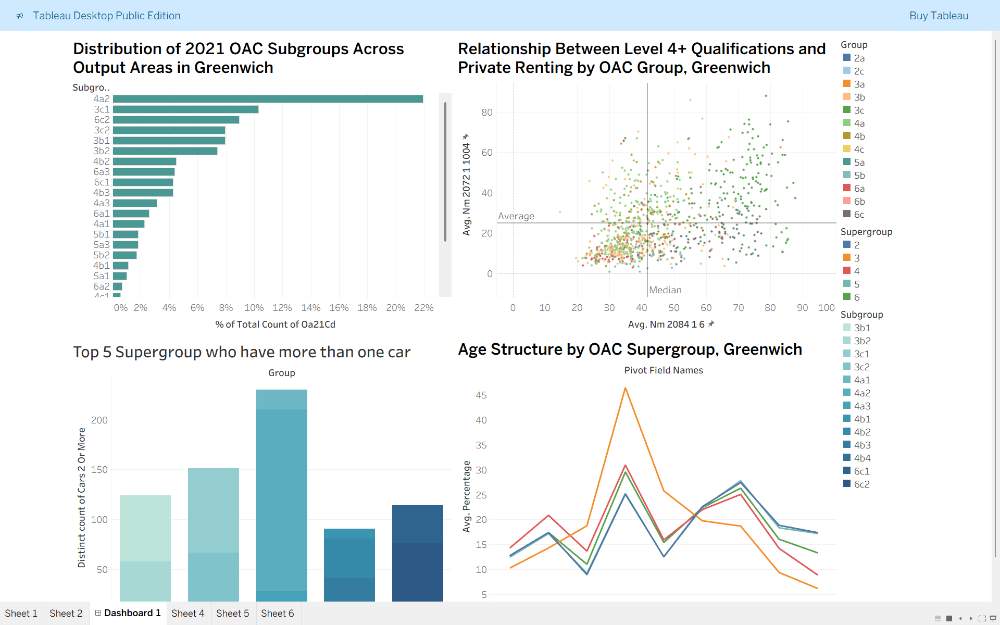

## 📊 OAC Analysis Dashboard – Greenwich (2021 Census)
Tableau dashboard analysing socio-demographic patterns in Greenwich using 2021 UK Census OAC data
---
## 📌 Project Overview

This project presents an interactive data visualization dashboard built using Tableau Public, analysing Output Area Classification (OAC) data for Greenwich based on the 2021 Census.

The dashboard explores demographic and socio-economic patterns, focusing on housing, education, age structure, and transportation indicators across OAC groups and subgroups.

---

## 🎯 Objectives

- Analyse the distribution of OAC supergroups across Greenwich
- Examine relationships between education levels (Level 4+) and private renting
- Identify patterns in car ownership (2+ cars) across different groups
- Understand age structure variations across OAC supergroups
---

## 📊 Dashboard Components

### 1. Distribution of OAC Supergroups
- Shows the proportion of each supergroup across output areas
- Highlights dominant population segments in Greenwich
### 2. Education vs Private Renting (Scatter Plot)
- Compares:
  - % of residents with Level 4+ qualifications
  - % of households in private renting
- Includes average and median reference lines
- Helps identify correlations between education and housing type
### 3. Car Ownership Analysis
- Displays average percentage of households owning 2+ cars
- Compared across OAC subgroups
- Highlights mobility and affluence patterns
### 4. Age Structure Analysis
- Line chart showing distribution across age groups
- Compared across OAC supergroups
- Helps identify demographic trends (e.g., younger vs older populations)
---

## 📈 Key Insights
- Certain OAC supergroups dominate the population distribution in Greenwich
- Moderate positive relationship between higher education levels and private renting
- Higher car ownership is concentrated in specific subgroups
- Age distribution varies significantly across supergroups, indicating diverse community structures
---

## 🛠 Tools & Technologies
- Tableau Public – Data visualization and dashboard creation
- Microsoft Excel / CSV – Data preparation
- UK Census 2021 OAC Dataset
---

## 📂 Repository Structure

├── data/               #  Raw / cleaned dataset

├── dashboard/          #  Tableau workbook (.twb / .twbx)

├── images/             #  Dashboard screenshots

├── README.md
---

## 🚀 How to Use
1. Download the Tableau workbook file (.twbx)
2. Open using Tableau Public/Desktop
3. Interact with filters and visuals to explore insights

## 📷 Dashboard Preview

## 📌 Future Improvements
- Add interactive filters (age, subgroup, geography)
- Include time-series comparison if data becomes available
- Enhance storytelling with annotations
---

## 👤 Author

Venkata Santosh Kumar
- Aspiring Data Analyst
- Skills: Tableau, SQL, Excel, Data Visualization

